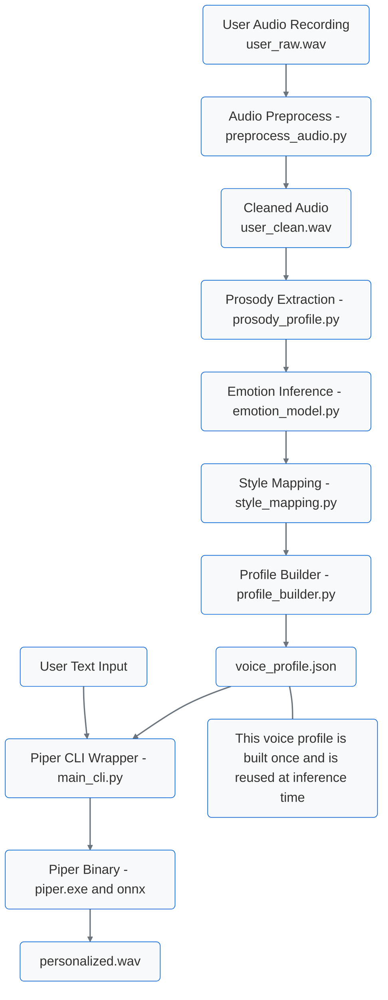
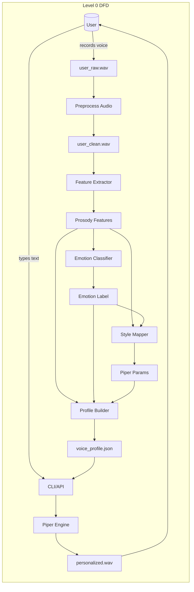

# Task 3 — Integration & Documentation

## 1. System Overview

This document describes how the personalization engine is integrated into the Piper TTS pipeline on a Windows environment. The system takes user audio, learns speaking patterns and emotional delivery, exports a reusable voice profile, and uses that profile when calling Piper to generate personalized speech.

Key components:

- Base TTS engine: Piper (`piper.exe` + ONNX voice model).
- Preprocessing: converts raw user recordings into clean, model-friendly WAV files.
- Analysis: extracts prosody features and infers emotion using praat-parselmouth and simple heuristics.
- Personalization engine: maps prosody + emotion to Piper runtime parameters.
- CLI: `main_cli.py` provides entrypoints to build JSON voice profiles and synthesize personalized speech.

---

## 2. Architecture

This shows where personalization fits into the TTS pipeline: user audio is analyzed once to produce a reusable profile, which is then used at inference time along with text input.

---

## 3. Data Flow Diagram (DFD)

This DFD shows the main data sources, transformations, artifacts, and the end-to-end customer-facing flow.

---

Main data items:

- `user_raw.wav` → raw user audio.
- `user_clean.wav` → normalized audio for analysis.
- Prosody features → pitch, energy, pauses, pacing.
- Emotion label → neutral/happy/sad/excited.
- Piper parameters → `length_scale`, `noise_scale`, `noise_w`.
- `voice_profile.json` → personalized voice profile.
- `personalized.wav` → synthesized personalized speech.

---

## 4. Component Interactions

### 4.1 Preprocessing (`preprocess_audio.py`)

Responsibility:

- Takes `user_raw.wav` recorded by the user.
- Uses pydub to:
  - Convert to mono.
  - Resample to 22,050 Hz.
  - Set 16‑bit sample width.
- Produces `user_clean.wav`.

Effect:

- Ensures consistent, Piper-compatible audio format.
- Reduces variability due to different recording tools.

Command:

py preprocess_audio.py

Input: user_raw.wav
Output: user_clean.wav

---

### 4.2 Feature Extraction (`prosody_profile.py`)

Responsibility:

- Loads `user_clean.wav` with praAT-Parselmouth.
- Computes:
  - Duration (seconds).
  - Pitch: mean and standard deviation of F0.
  - Intensity: mean and standard deviation.
  - Rhythm:
    - `speech_event_rate` (proxy for speaking rate).
    - `num_pauses`, `pause_rate` (based on intensity drops).

Effect:

- Captures user-specific pacing, rhythm, pauses, stress and pitch variation.

Command:

py prosody_profile.py

Prints a dict with prosody features

---

### 4.3 Emotion Detection (`emotion_model.py`)

Responsibility:

- Implements a simple, rule-based classifier over prosody features.
- Uses thresholds on:
  - Pitch variability (`std_f0`).
  - Energy variability (`std_energy`).
  - Speaking rate (`speech_event_rate`).
  - Pause rate (`pause_rate`).

Output:

- Returns one of: `"neutral"`, `"happy"`, `"sad"`, `"excited"`.

Effect:

- Provides a coarse emotional label that can be used to nudge TTS parameters (slower / faster, more / less expressive).

---

### 4.4 Style Mapping (`style_mapping.py`)

Responsibility:

- Takes prosody features and an emotion label.
- Outputs Piper runtime parameters:
  - `length_scale` → controls speed.
  - `noise_scale` and `noise_w` → control expressiveness / variation.

Typical mapping:

- Faster speakers → smaller `length_scale`.
- Larger pitch variation (`std_f0`) → higher `noise_scale`/`noise_w`.
- Emotion:
  - excited → slightly faster, more expressive.
  - sad → slightly slower, less expressive.
  - happy → slightly more expressive than neutral.

---

### 4.5 Profile Building (`profile_builder.py`)

Responsibility:

- Orchestrates:
  - `extract_prosody` (prosody_profile.py).
  - `infer_emotion` (emotion_model.py).
  - `prosody_to_piper_params` (style_mapping.py).
- Builds and saves a JSON profile:

{
"version": "1.0",
"user_id": "default_user",
"source_audio": "user_clean.wav",
"prosody_features": { ... },
"dominant_emotion": "neutral",
"piper_runtime_params": {
"length_scale": 0.9,
"noise_scale": 0.6,
"noise_w": 0.7
}
}

Command:

py profile_builder.py

Output: voice_profile.json

---

### 4.6 TTS Integration (`main_cli.py` + Piper)

Responsibilities:

- CLI entrypoint to:
  - Train/build profile.
  - Run Piper with personalized parameters.

Options:

- `--train-profile`: analyzes `user_clean.wav` and writes `voice_profile.json`.
- `--text`: text to synthesize.
- `--output`: output WAV file name.
- `--profile`: path to profile JSON (default `voice_profile.json`).

When synthesizing:

- Loads `voice_profile.json`.
- Reads `length_scale`, `noise_scale`, `noise_w`.
- Constructs a Piper command like:

"C:\piper\piper\piper"
--model "C:\piper\piper\en_US-kathleen-low.onnx"
--length_scale 0.9
--noise_scale 0.6
--noise_w 0.7
--output_file "personalized.wav"

- Sends the user text to Piper’s stdin.
- Piper generates `personalized.wav`.

---

## 5. Integration Points

### 5.1 Data Preprocessing Integration

Flow:

1. User records voice → `user_raw.wav` saved in project folder.
2. Run:

py preprocess_audio.py

3. `user_clean.wav` becomes the **single source** for feature extraction, emotion inference, and profile building.

Design decision:

- Preprocessing is decoupled from TTS; it only runs when a new or updated user recording is provided.

---

### 5.2 Fine-tuning vs. Runtime Personalization

- This project does **not** retrain or fine-tune Piper models.
- It uses Piper as a black-box TTS engine and personalizes behavior at **runtime** via:
  - Speed control (`length_scale`).
  - Prosody variation (`noise_scale`, `noise_w`).
- True fine-tuning would require:
  - Creating a full LJSpeech-style dataset from user recordings.
  - Using Piper’s training pipeline.
  - GPU / training time.

---

### 5.3 Real-time Inference Considerations

- Piper is designed for near real-time TTS even on CPU.
- Added overhead from personalization:
  - Loading `voice_profile.json` (very small).
  - Adjusting a few command-line arguments.
- Prosody and emotion analysis are done once during `--train-profile`, not per synthesis, so inference speed remains almost identical to native Piper.

---

## 6. Usage Examples (Windows CLI)

### 6.1 Full workflow

In `C:\piper_personalization`:

1) User records audio and saves as user_raw.wav
py preprocess_audio.py

-> user_clean.wav
2) Train / build personalized profile
py main_cli.py --train-profile

-> voice_profile.json
3) Generate personalized TTS
py main_cli.py --text "This is my personalized Piper voice." --output personalized.wav

-> personalized.wav

Results:

- `voice_profile.json` includes:
  - Measured prosody features.
  - Inferred dominant emotion.
  - Piper runtime parameters.
- `personalized.wav` is created and reflects the user’s speaking speed and expressiveness more closely than a default call.

### 6.2 Baseline vs Personalized Comparison

Baseline (no personalization):

cd C:\piper\piper
"Hello, this is baseline Piper." |
.\piper --model .\en_US-kathleen-low.onnx --output_file baseline.wav

Personalized:

cd C:\piper_personalization
py main_cli.py --text "Hello, this is my personalized Piper voice." --output personalized.wav

Observed differences:

- Speed: matches user’s average pacing (faster/slower).
- Expressiveness: increased or decreased pitch variability based on user speech.
- Emotion: slightly more excited/neutral/sad according to profile parameters.

---

## 7. Sample Outputs

- **Audio files**:
  - `baseline.wav` and `personalized.wav` for listening comparison.

### Voice similarity vs full voice cloning

This Phase-1 implementation does not fine-tune or retrain the Piper ONNX model on user audio (full voice cloning). Instead, it:

- learns user prosody (speed, pauses, pitch variation, coarse emotion) from `user_raw.wav`,
- maps these features into Piper runtime parameters (`length_scale`, `noise_scale`, `noise_w`),
- applies them at synthesis time.

This makes the output voice keep the original Piper timbre (e.g. en_US-kathleen) but follow the user's timing and expressiveness. Full retraining to match the user's timbre is explicitly left as future work.

