# Task 1 — TTS Dataset Analysis 

## 1. Overview

This document analyzes several standard text-to-speech (TTS) datasets and explains how their properties affect synthesized voice characteristics such as clarity, naturalness, accent, pitch, timbre, and emotional expressiveness. The focus is on single-speaker and multi-speaker corpora commonly used to train neural TTS systems similar to Piper TTS. 

The datasets covered are LJSpeech, VCTK, LibriTTS, Hi-Fi Multi-Speaker English TTS, and HUI-Audio-Corpus-German. Based on their design and recording conditions, this document derives practical guidelines for selecting and preparing datasets for diverse voice profiles. 

---

## 2. Core TTS Datasets

### 2.1 LJSpeech

- Single female English speaker reading non‑fiction book text; around 13,100 audio clips totaling approximately 24 hours. 
- Audio format: 16-bit PCM, mono WAV, sampled at 22.05 kHz; each clip is 1–10 seconds long with an aligned text transcript. 
- Text domain: public domain books, mostly neutral reading style without extreme emotion. 

**Voice characteristics supported**

- Very stable timbre and accent because data comes from a single speaker in a consistent studio-like environment.   
- Reasonably clear and natural speech for general-purpose English voices, but limited accent and emotional diversity. 

---

### 2.2 VCTK Corpus

- Approximately 110 English speakers (both male and female), with each speaker reading about 400 sentences.   
- Designed to cover multiple accents, especially a range of British accents and some non-native English speakers.  
- Recordings captured in a controlled environment with high-quality microphones. 

**Voice characteristics supported**

- Good for modeling accent variation and building multi-speaker, accent-conditioned TTS systems.  
- Timbre diversity (different speakers and genders) helps learn richer speaker embeddings but requires careful balancing to avoid over-representing certain accents. 

---

### 2.3 LibriTTS

- Large-scale multi-speaker English corpus derived from LibriVox audiobooks, around 585 hours of speech at 24 kHz. 
- Includes train/dev/test splits and variants with normalized text, designed specifically for TTS training.   
- Audio is segmented at sentence boundaries, and noisy or low-quality utterances are filtered out. 

**Voice characteristics supported**

- High naturalness and expressive prosody due to audiobook narration with varied intonation and pacing.   
- Multi-speaker nature supports modeling different timbres and speaking styles but also introduces variability in recording conditions. 

---

### 2.4 Hi-Fi Multi-Speaker English TTS Dataset

- High-fidelity English TTS dataset with around 292 hours of speech from 10–11 speakers, each contributing at least 16–17 hours.  
- Audio recorded at 44.1 kHz sampling rate with signal-to-noise ratio ≥32 dB and bandwidth ≥13 kHz to ensure high quality.
- Source material from LibriVox and Project Gutenberg, selecting segments with consistent quality and narration. 

**Voice characteristics supported**

- Very high clarity and rich timbre due to high sampling rate and carefully controlled noise levels.   
- Suitable for models targeting premium “hi-fi” output where subtle nuances in pitch and brightness matter. 

---

### 2.5 HUI-Audio-Corpus-German

- High-quality German speech corpus with multiple speakers and separate “full” and “clean” subsets for TTS training.   
- Audio recorded at 44.1 kHz with consistent recording conditions; the clean subset removes lower-quality or noisy segments.   
- Designed to support robust German TTS in different domains.

**Voice characteristics supported**

- Clear and natural German speech with consistent pronunciation, making it suitable for high-quality German voices.   
- Clean subset improves stability and reduces artifacts in synthesized speech compared to using raw full data. 

---

## 3. Dataset Properties and Voice Characteristics

This section links dataset design choices to how a trained TTS voice sounds.

### 3.1 Sampling Rate and Bit Depth

- Higher sampling rates (24 kHz, 44.1 kHz) capture more high-frequency content, which improves perceived clarity, sharpness, and timbre detail; datasets like LibriTTS, Hi-Fi, and HUI use ≥24 kHz.  
- 16-bit PCM with proper peak control avoids clipping and quantization noise, which supports smoother, artifact-free synthesis.

**Impact on synthesized voice**

- Low sampling rates or inconsistent formats can make synthesized voices sound muffled or “telephone-like,” especially at high frequencies.  
- Clean, uniform sampling rate across the dataset produces more consistent pitch, formants, and spectral envelope, improving naturalness. 

---

### 3.2 Noise Level and Recording Conditions

- LibriTTS filters out noisy utterances and enforces quality thresholds to remove severe background noise or distortions.  
- Hi-Fi Multi-Speaker and HUI German emphasize high SNR and controlled recording conditions, and HUI provides a dedicated clean subset. 

**Impact on synthesized voice**

- High noise levels during training cause models to learn background hiss and unstable prosody, leading to artifacts during synthesis. 
- Training on uniformly clean audio yields clearer voices and more accurate modeling of pauses and silence, which improves perceived naturalness. 

---

### 3.3 Speaker Count and Distribution

- LJSpeech: single female speaker, resulting in a very stable, single identity voice.   
- VCTK and LibriTTS: many speakers with various accents, genders, and ages.   
- Hi-Fi and HUI: moderate number of speakers with significant hours per speaker and well-documented metadata. 

**Impact on synthesized voice**

- Single-speaker datasets produce consistent timbre and accent but lack flexibility for other speaker identities. 
- Multi-speaker datasets enable training models that can generate different speakers or speaker-conditioned voices, but require balancing so that frequent speakers do not dominate. 

---

### 3.4 Accent, Language, and Text Domain

- VCTK is intentionally diversified across UK accents and some non-native speakers.   
- LibriTTS and Hi-Fi focus on English but include varied narrators and literary text. 
- HUI-Audio-Corpus-German is targeted specifically at German TTS with controlled recordings. 

**Impact on synthesized voice**

- Training on the wrong accent or language relative to target usage produces foreign-sounding pronunciation and reduced intelligibility.  
- Rich accent diversity cases  can be used for accent-controllable models, but may reduce clarity if accents are mixed without proper labeling or conditioning. 

---

### 3.5 Prosody, Emotion, and Speaking Style

- Audiobook-based datasets such as LibriTTS and Hi-Fi contain natural variation in pitch, tempo, and emphasis, including questions, exclamations, and emotional narration.  
- LJSpeech is more neutral but still includes some variation in phrasing and emphasis across long-form reading. 

**Impact on synthesized voice**

- Expressive datasets allow models to learn richer prosody patterns, making synthesized speech sound less robotic and more human-like. 
- If training data is predominantly flat, neutral speech, the model tends to produce monotone output even when given expressive text. 

---

### 3.6 Text Coverage and Phonetic Diversity

- LibriTTS uses a large, diverse text corpus from audiobooks, increasing coverage of phonemes, words, and sentence structures.   
- Datasets with limited vocabulary or repetitive phrases cause the model to overfit specific patterns and struggle with rare or unseen words. 

**Impact on synthesized voice**

- Broad phonetic coverage improves pronunciation robustness and reduces unnatural pitch jumps on rare phoneme sequences. 
- Adequate coverage of numerals, abbreviations, and domain-specific terms is critical for assistant-like voices or specialized domains. 

---

## 4. Guidelines for Selecting and Preparing Datasets

This section translates the observations above into actionable guidelines to design or choose training datasets for systems like Piper.

### 4.1 Match Dataset to Target Voice Profile

- For a **single, branded voice** (e.g., a consistent assistant voice), choose a single-speaker dataset or a filtered subset (similar to LJSpeech or one speaker from HUI). 
- For **multi-speaker or accent-aware TTS**, choose corpora like VCTK or LibriTTS and ensure speaker and accent labels are available for conditioning. 

---

### 4.2 Ensure Audio Quality and Consistency

- Standardize audio to mono, 16-bit PCM, and at least 22.05 kHz; for premium quality voices, prefer 24 kHz or 44.1 kHz when supported by the model.  
- Remove or down-weight utterances that contain strong background noise, clipping, or artifacts; leverage clean subsets (e.g., HUI clean, filtered LibriTTS) where possible. 

---

### 4.3 Control Prosody and Style in the Dataset

- Decide if the target voice should be neutral, conversational, or highly expressive, and select recordings accordingly; audiobook-style data is better for expressive prosody.   
- Include a mix of sentence types (statements, questions, exclamations) to help the model learn appropriate intonation patterns for different punctuation. 

---

### 4.4 Text and Phonetic Coverage

- Analyze the text corpus for coverage of phonemes and word types; aim for balanced phoneme distribution rather than many repeats of a small set of sentences.  
- Ensure that the dataset includes domain-specific terminology and numerals if the target application is an assistant or information system. 

---

### 4.5 Speaker Metadata and Balancing Strategies

- Maintain clear metadata: speaker ID, gender, accent, recording session, and environment; this supports speaker embeddings or conditional TTS.  
- During training, use sampling strategies that balance per speaker (e.g., equal samples per speaker per batch) to avoid bias towards speakers with more recordings. 

---

### 4.6 Preprocessing and Alignment

- Normalize loudness and trim leading/trailing silence to stabilize training and reduce irrelevant variability.   
- Ensure accurate alignment between text and audio segments (sentence-level or utterance-level) to improve attention and convergence in sequence-to-sequence TTS models. 

---

## 5. Diagrams (Mermaid)

## 1. Dataset Pipeline

```mermaid
flowchart LR
  %% Sources
  subgraph Sources[" "]
    A["📚 Raw Audio & Text Sources\n(Audiobooks, Scripts, Web Text)"]
  end

  %% Cleaning / prep stages
  A --> B{{"🧹 Data Cleaning"}}
  B --> C["✂️ Segmentation\n(split into utterances)"]
  C --> D["🔗 Alignment\n(audio ↔ text)"]
  D --> E["⚖️ Normalization\n(text, sampling rate, loudness)"]
  E --> F["🔬 Feature Extraction\n(mel-spectrograms, phonemes, prosody)"]
  F --> G(["🎯 Training Dataset\n(ready for TTS models like Piper)"])

  %% Minimal styling that most Mermaid renderers accept
  classDef stage fill:#ECFEFF,stroke:#0891B2,color:#05445E;
  class A,B,C,D,E,F,G stage;
```

This diagram shows the journey from raw recordings and text to a training-ready dataset (used in corpora like LibriTTS/HUI).

## 1.2 Feature Extraction Flow

This diagram visualizes parallel audio and text processing streams that converge into the TTS model input.

### 1.3 Voice Characteristic Mapping (Conceptual)

This conceptual map links dataset design to learned latent space and then to perceived voice qualities.

---

## 6. Relationship to Piper TTS

Piper TTS typically expects training data in formats similar to LJSpeech (e.g., WAV files with a metadata file of audio–text pairs).  The datasets described above provide different trade-offs in terms of speaker diversity, quality, and prosody, which directly influence how a Piper-trained voice sounds:

- Using LJSpeech-like data yields a stable, single English female voice with good clarity but limited accent and emotional variation.  
- Multi-speaker datasets like VCTK, LibriTTS, Hi-Fi, and HUI enable training Piper models that can support multiple voices, accents, or languages, at the cost of more complex training and balancing. 
When building personalized or multi-profile voices on top of Piper, following the guidelines in Section 4 helps select or construct datasets that match desired voice characteristics while maintaining high clarity and naturalness. 

