# Dataset Pipeline & Architecture (Mermaid + Light fallback)

I fixed formatting issues, removed duplicate headings, simplified where Mermaid styling can cause rendering problems, and added a light (plain-text) fallback that will display well if Mermaid or rich styling does not render.

## 1. Dataset Pipeline

Below are refreshed Mermaid diagrams (styled but kept compatible). If your viewer cannot render the full styles, use the "Light display" plain-text section after the Mermaid blocks.

```mermaid
flowchart LR
  %% Sources
  subgraph Sources[" "]
    A["📚 Raw Audio & Text Sources\n(Audiobooks, Scripts, Web Text)"]
  end

  %% Cleaning / prep stages
  A --> B{{"🧹 Data Cleaning"}}
  B --> C["✂️ Segmentation\n(split into utterances)"]
  C --> D["🔗 Alignment\n(audio ↔ text)"]
  D --> E["⚖️ Normalization\n(text, sampling rate, loudness)"]
  E --> F["🔬 Feature Extraction\n(mel-spectrograms, phonemes, prosody)"]
  F --> G(["🎯 Training Dataset\n(ready for TTS models like Piper)"])

  %% Minimal styling that most Mermaid renderers accept
  classDef stage fill:#ECFEFF,stroke:#0891B2,color:#05445E;
  class A,B,C,D,E,F,G stage;
```

This diagram shows the journey from raw recordings and text to a training-ready dataset (used in corpora like LibriTTS/HUI).

## Feature Extraction Flow

This diagram visualizes parallel audio and text processing streams that converge into the TTS model input.

### 1.3 Voice Characteristic Mapping (Conceptual)

This conceptual map links dataset design to learned latent space and then to perceived voice qualities.
## 2. Architecture

## 3. Data Flow Diagram (DFD) — Level 0

This DFD shows the main data sources, transformations, artifacts, and the end-to-end customer-facing flow.

---

